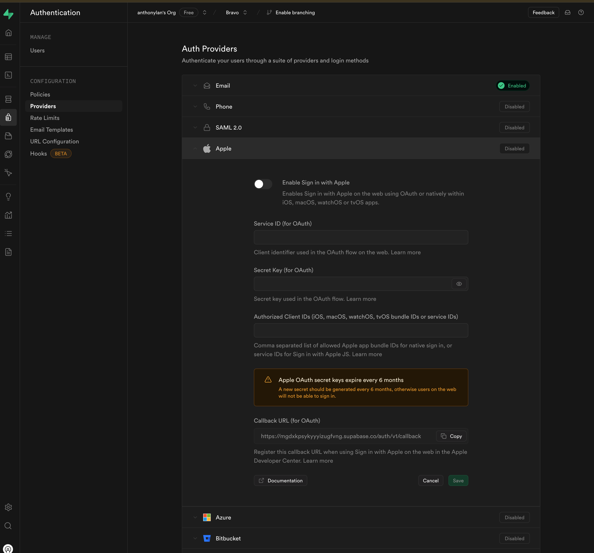
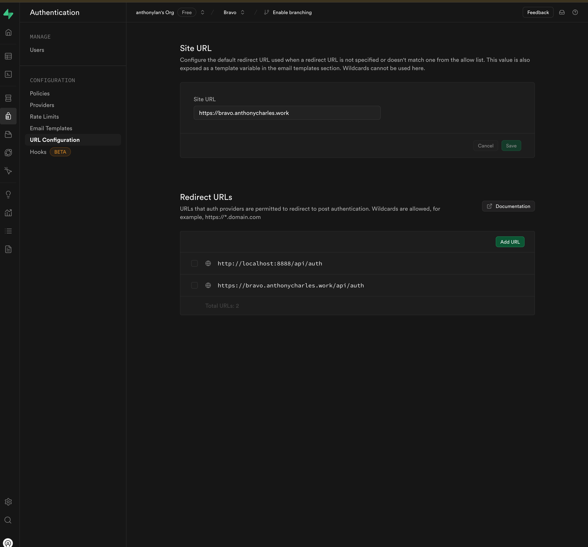

# Supabase Services Documentation

This documentation covers the `UserService`, `Database`, and `Storage` classes from the `supabase.ts` file, which provide interfaces for interacting with Supabase functionalities.

## IMPORTANT: 

**Auth**: Before using authentication providers, ensure they are enabled in your Supabase Authentication settings. Configure your site URL and redirect URLs in the URL Configuration section.

**Storage**: If you plan to use public URLs, make sure your storage buckets are set to public. However, it's recommended to apply specific access policies for security.

**Database**: As always, ensure that your table columns align with the data structure you intend to store.

[Supabase Javascript](https://supabase.com/docs/reference/javascript/introduction)


### From my own setup:





## Table of Contents
1. [UserService](#userservice)
2. [Database](#database)
3. [Auth](#auth)
4. [Storage](#storage)

## UserService

The `UserService` class provides methods for managing user-related operations.

### Methods

#### updateUserMeta

Update user metadata in Supabase.

```typescript
static async updateUserMeta(meta: UserMeta): Promise<ServiceResponse>
```

##### Parameters:
- `meta` (UserMeta): An object containing key-value pairs for user metadata.

##### Returns:
- Promise<ServiceResponse>: The result of the update operation.

##### Usage:
```typescript
const result = await UserService.updateUserMeta({ birth_day: '1995/03/12', custom_name: 'John Doe' });
if (result.error) {
  console.error(result.error);
} else {
  console.log(result.data);
}
```

#### getUser

Get the current user session from Supabase.

```typescript
static async getUser(): Promise<any>
```

##### Returns:
- Promise<any>: The current user or null if not authenticated.

##### Usage:
```typescript
const user = await UserService.getUser();
if (user) {
  console.log('Logged in user:', user);
} else {
  console.log('No user logged in');
}
```

## Database

The `Database` class provides methods for interacting with Supabase tables.

### Methods

#### set

Add or update a record in the specified table.

```typescript
static async set(table: string, payload: RecordData): Promise<any>
```

##### Parameters:
- `table` (string): The name of the table.
- `payload` (RecordData): The data to insert or update.

##### Returns:
- Promise<any>: The result of the upsert operation.

##### Usage:
```typescript
const result = await Database.set('users', { id: 1, name: 'John Doe' });
if (result.error) {
  console.error(result.error);
} else {
  console.log(result.data);
}
```

#### fetch

Fetch records from the specified table based on query parameters.

```typescript
static async fetch(table: string, qs: { key: string; value: string }): Promise<any>
```

##### Parameters:
- `table` (string): The name of the table.
- `qs` (object): Query parameters containing the key and value.

##### Returns:
- Promise<any>: The fetched records or error message.

##### Usage:
```typescript
const result = await Database.fetch('users', { key: 'name', value: 'John Doe' });
if (result.error) {
  console.error(result.error);
} else {
  console.log(result.data);
}
```

#### delete

Delete a record in the specified table by ID.

```typescript
static async delete(table: string, id: number): Promise<ServiceResponse>
```

##### Parameters:
- `table` (string): The name of the table.
- `id` (number): The ID of the record to delete.

##### Returns:
- Promise<ServiceResponse>: The result of the delete operation.

##### Usage:
```typescript
const result = await Database.delete('users', 1);
if (result.error) {
  console.error(result.error);
} else {
  console.log('Record deleted successfully');
}
```


## Auth 

The `Auth` class provides methods for handling various authentication operations using Supabase.

## Methods

### handleOAuth

Handles OAuth login for various providers.

```typescript
static async handleOAuth(provider: any): Promise<{ error: string | null }>
```

#### Parameters:
- `provider` (any): The OAuth provider (e.g., 'google', 'facebook', etc.)

#### Returns:
- Promise<{ error: string | null }>: An object with an error message if the operation fails, or null if successful.

#### Usage:
```typescript
const result = await Auth.handleOAuth('google');
if (result.error) {
  console.error(result.error);
} else {
  console.log('OAuth login successful');
}
```

### handleEmailAuth

Handles email/password login or signup.

```typescript
static async handleEmailAuth(
  form: { email: string; password: string; name?: string },
  isLogin: boolean,
  emailRedirectTo?: string
): Promise<{ error: string | null }>
```

#### Parameters:
- `form` (object): An object containing the user's email, password, and optionally their name.
- `isLogin` (boolean): True if this is a login attempt, false if it's a signup attempt.
- `emailRedirectTo` (string, optional): The URL to redirect to after email confirmation (for signup).

#### Returns:
- Promise<{ error: string | null }>: An object with an error message if the operation fails, or null if successful.

#### Usage:
```typescript
const loginResult = await Auth.handleEmailAuth({ email: 'user@example.com', password: 'password123' }, true);
if (loginResult.error) {
  console.error(loginResult.error);
} else {
  console.log('Login successful');
}

const signupResult = await Auth.handleEmailAuth({ email: 'newuser@example.com', password: 'password123' }, false, 'https://yourapp.com/welcome');
if (signupResult.error) {
  console.error(signupResult.error);
} else {
  console.log('Signup successful');
}
```

### handleReset

Handles sending a password reset email.

```typescript
static async handleReset(email: string, url: string): Promise<{ error: string | null }>
```

#### Parameters:
- `email` (string): The email address of the user requesting a password reset.
- `url` (string): The URL to send the user to after they click the password reset link.

#### Returns:
- Promise<{ error: string | null }>: An object with an error message if the operation fails, or null if successful.

#### Usage:
```typescript
const result = await Auth.handleReset('user@example.com', 'https://yourapp.com/reset-password');
if (result.error) {
  console.error(result.error);
} else {
  console.log('Password reset email sent successfully');
}
```

### handlePassword

Handles updating the user's password.

```typescript
static async handlePassword(password: any): Promise<{ error: string | null }>
```

#### Parameters:
- `password` (any): The new password for the user.

#### Returns:
- Promise<{ error: string | null }>: An object with an error message if the operation fails, or null if successful.

#### Usage:
```typescript
const result = await Auth.handlePassword('newPassword123');
if (result.error) {
  console.error(result.error);
} else {
  console.log('Password updated successfully');
}
```


## Storage

The `Storage` class provides methods for managing file storage in Supabase.

### Constructor

```typescript
constructor(bucket: string)
```

##### Parameters:
- `bucket` (string): The name of the storage bucket.

### Methods

#### upload

Upload a file to a specific folder in the bucket.

```typescript
async upload(file: File, config: { folder: string; publicUrl: boolean }): Promise<ServiceResponse>
```

##### Parameters:
- `file` (File): The file to upload.
- `config` (object): Folder and public URL options.

##### Returns:
- Promise<ServiceResponse>: The result of the upload.

##### Usage:
```typescript
const storage = new Storage('my-bucket');
const file = new File(['file content'], 'example.txt', { type: 'text/plain' });
const result = await storage.upload(file, { folder: 'documents', publicUrl: true });
if (result.error) {
  console.error(result.error);
} else {
  console.log(result.data);
}
```

#### fetch

Fetch and list files from a specific folder with a limit.

```typescript
async fetch(folder: string, limit: number): Promise<ServiceResponse>
```

##### Parameters:
- `folder` (string): The folder to list files from.
- `limit` (number): The maximum number of files to fetch.

##### Returns:
- Promise<ServiceResponse>: The list of files or error message.

##### Usage:
```typescript
const storage = new Storage('my-bucket');
const result = await storage.fetch('documents', 10);
if (result.error) {
  console.error(result.error);
} else {
  console.log(result.files);
}
```

#### delete

Delete a file from the specified folder in the bucket.

```typescript
async delete(name: string, folder: string): Promise<ServiceResponse>
```

##### Parameters:
- `name` (string): The name of the file to delete.
- `folder` (string): The folder where the file resides.

##### Returns:
- Promise<ServiceResponse>: The result of the delete operation.

##### Usage:
```typescript
const storage = new Storage('my-bucket');
const result = await storage.delete('example.txt', 'documents');
if (result.error) {
  console.error(result.error);
} else {
  console.log('File deleted successfully');
}
```

## Note on Supabase Client Initialization

The Supabase client is initialized using environment variables:

```typescript
const supabaseUrl = import.meta.env.VITE_SUPABASE_URL;
const supabaseKey = import.meta.env.VITE_SUPABASE_ANON_KEY;
const supabase = createClient(supabaseUrl, supabaseKey);
```

Ensure that these environment variables are properly set in your project.